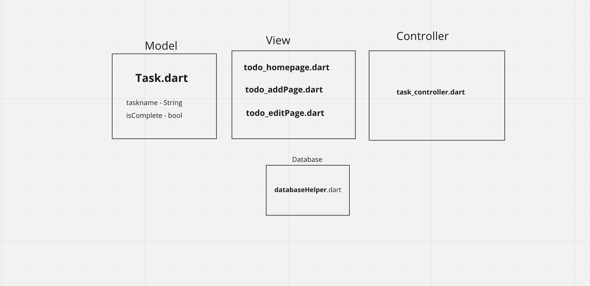
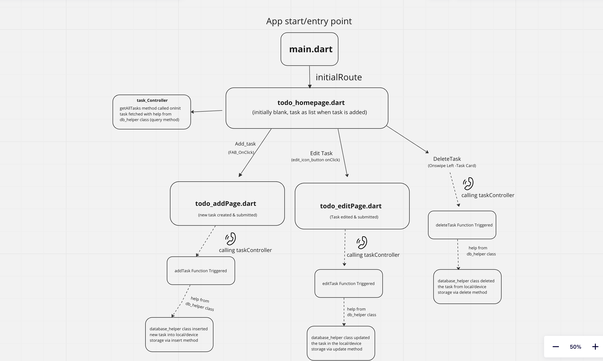
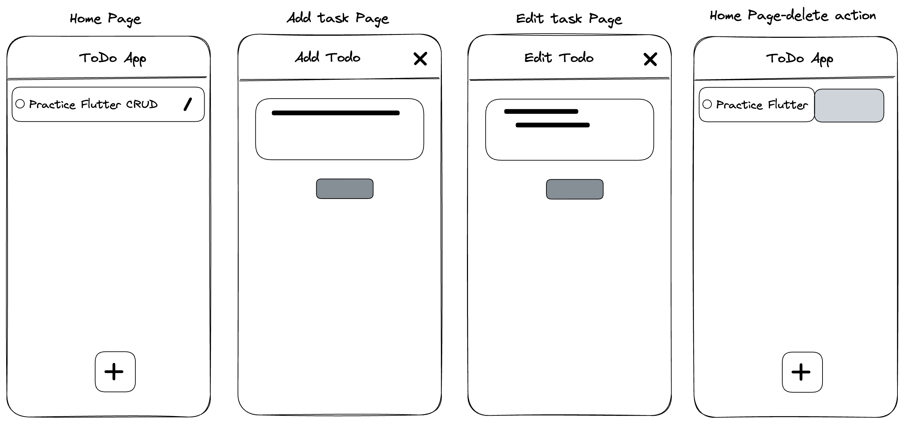

# Flutter Todo App- GetX and SQFLite.

  

Todo app with Persistent Local Storage using SQFLite. State management using GetX. MVC architecture used.
Used a reactive approach to update the UI so that the UI is updated automatically when the data changes. 
This makes UI rebuild and state changes pretty instant and smooth.SQLite offers a great solution for large storage needs and easily stored 
in the device.
- The simple todo app illustrates the CRUD(Create, Read, Update and Delete) operations that can be easily applied to different ideas and approaches.
- Task manager/ simple todo app is a great way to learn state management and storage solutions as well.
- This app uses dismissible cards to delete tasks and snackbar to show task deleted messages. Both these features offer
  a simple and smooth animation/ transition effect to improve the user experience.
- This project can be easily customized to make other type of notes/ events/ tasks/ reminders/ tracking apps.

## packages/dependencies used:

- [Flutter](https://flutter.dev/)
- [GetX](https://pub.dev/packages/get/install)
- [SQFLite](https://pub.dev/packages/sqflite/install)
- [Path Provider](https://pub.dev/packages/path_provider)
- [Lottie](https://pub.dev/packages/lottie)

## App Architecture:MVC

## App Business Logic flow:

## Low-Fi Wireframe:

## See  quick Video & Screenshots below:

## Credits:
- [LottieFiles](https://lottiefiles.com/78631-searching)

